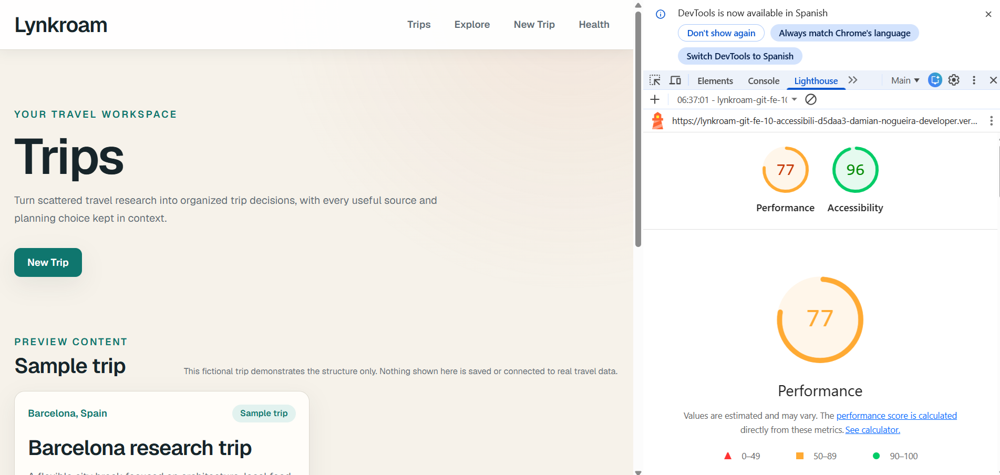
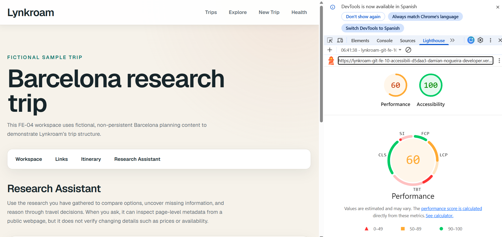
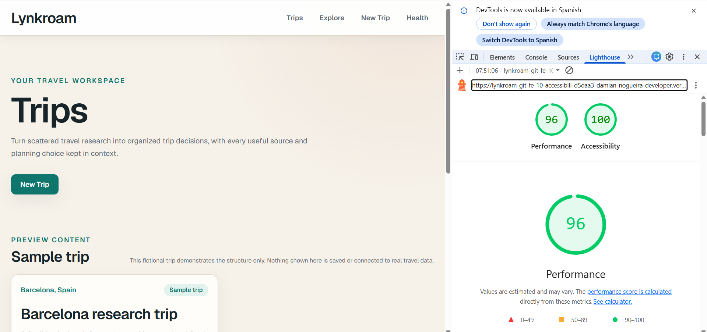
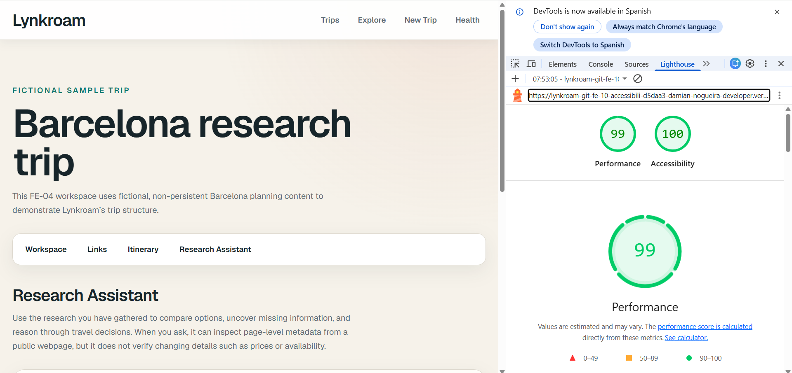

# FE-10 Accessibility and Performance Audit

This audit records the verified FE-10 accessibility and mobile-performance baseline, the focused changes made, and the final validation results for Lynkroam. The audited experience covered the Trips dashboard, trip workspace, Research Assistant states, and the 3D Trip Explorer.

## Audited routes and states

- `/` — Trips dashboard
- `/trips/barcelona` — Workspace
- `/trips/barcelona/assistant` — idle state
- Research Assistant — normal streamed response
- Research Assistant — metadata result
- `/explore` — 3D Trip Explorer

## Lighthouse Mobile

### Before

| Metric | Trips dashboard | Research Assistant |
| --- | ---: | ---: |
| Performance | 77 | 60 |
| Accessibility | 96 | 100 |
| First Contentful Paint | 1.0 s | 0.9 s |
| Largest Contentful Paint | 2.7 s | 3.4 s |
| Total Blocking Time | 440 ms | 920 ms |
| Cumulative Layout Shift | 0 | 0 |
| Speed Index | 8.8 s | 13.2 s |
| Transfer size | ~232 KiB | ~310 KiB |
| Unused JavaScript estimate | ~29.2 KiB | ~85.6 KiB |
| Long tasks | 6 | 8 |

#### Trips dashboard before

#### Research Assistant before

### After

Three clean Lighthouse Mobile runs were collected for each route. Because the runs showed normal variance, the median is used for the final comparison.

| Route | Performance runs | Median performance | Accessibility runs | Final accessibility |
| --- | --- | ---: | --- | ---: |
| Trips dashboard | 92, 96, 98 | 96 | 100, 100, 100 | 100 |
| Research Assistant | 99, 99, 98 | 99 | 100, 100, 100 | 100 |

#### Trips dashboard after

The recorded screenshot shows a 96 Performance and 100 Accessibility run.

#### Research Assistant after

The recorded screenshot shows a 99 Performance and 100 Accessibility run.

### Score change

| Route | Performance | Accessibility |
| --- | ---: | ---: |
| Trips dashboard | 77 → 96 median (+19) | 96 → 100 (+4) |
| Research Assistant | 60 → 99 median (+39) | 100 → 100 (unchanged) |

## Accessibility audit

### WAVE results

| Route or state | Before Errors | Before Contrast | Before Alerts | After Errors | After Contrast | After Alerts |
| --- | ---: | ---: | ---: | ---: | ---: | ---: |
| Trips dashboard | 0 | 1 | 1 | 0 | 0 | 1 |
| Workspace | 0 | 6 | 1 | 0 | 0 | 1 |
| Assistant idle | 0 | 0 | 1 | 0 | 0 | 1 |
| Assistant normal response | 0 | 0 | 1 | 0 | 0 | 1 |
| Assistant metadata result | 0 | 0 | 2 | 0 | 0 | 1 |
| 3D Trip Explorer | 0 | 2 | 2 | 0 | 0 | 2 |

Every audited route and state finished with zero WAVE Errors and zero Contrast Errors.

### Fixes completed

- Added the accessible text accent token `--color-accent-strong: #ad5b42` and migrated visible normal-size accent text to it while retaining the original decorative accent color.
- Updated the Barcelona static-preview marker to use the strong accent background, resolving its white-on-accent contrast failure without changing other decorative destination styling.
- Corrected the metadata result heading from `h4` to `h3`, restoring the effective `h1` → `h2` → `h3` hierarchy.
- Added a dedicated visually hidden streamed-response region with `role="status"`, `aria-live="polite"`, and `aria-atomic="true"`. It publishes sentence-sized progress, flushes trailing text once on ready or error, tracks announced offsets to avoid rereading earlier content, and uses sequence-keyed updates so identical consecutive announcements still replace the live-region node.
- Preserved Stop as a native keyboard-accessible button.

### Remaining WAVE alerts

- **Redundant link:** the brand link and the Trips navigation link both point to `/`. This reflects the current routing and product navigation architecture. It is documented for future information-architecture review rather than changed during this focused audit.
- **Possible heading on Explore:** the selected destination is intentionally a paragraph used as contextual content, not a section heading. The surrounding heading hierarchy is valid, so this is treated as a heuristic alert.
- **Metadata skipped heading:** fixed by changing the result-card title from `h4` to `h3`; the alert disappeared in the after audit.

### Keyboard-only verification

All eight audited interactions passed:

1. Skip link works.
2. Top-level navigation is reachable by Tab with visible focus.
3. A starter prompt fills and focuses the composer.
4. Enter submits.
5. Shift+Enter inserts a new line.
6. Stop is keyboard reachable and operable.
7. The composer remains usable after Stop.
8. No focus trap was observed.

### Narrator verification

- Streamed output was announced progressively without rereading the preceding response.
- Streaming announcements did not move focus.
- Stop remained reachable and the composer remained usable.
- The Thinking state was too brief for reliable speech confirmation during the manual run; this is recorded as a verification limitation rather than an unsupported claim.

## Performance investigation and optimization

### Diagnosis

The Research Assistant initially shipped its `useChat` runtime eagerly. Its route-specific client JavaScript included the AI SDK browser runtime and Zod-related runtime utilities before the user interacted with the composer. Three and React Three Fiber were not present in the initial Trips or Assistant bundles, the global navigation was already a Server Component, and a controlled metadata-renderer lazy-loading experiment produced no meaningful gzip saving.

### Final architecture

- The accessible chat shell remains immediately available with its textarea visible and focusable.
- The same textarea DOM node is preserved while the runtime loads.
- Transcript rendering, scrolling, tools, composer state, and live regions remain in the persistent shell.
- The `useChat` controller loads through `next/dynamic` only after genuine user intent: textarea focus, starter-prompt activation, or valid submission.
- There is no timer-based loading, viewport-triggered hydration, or launch gate.
- If submission precedes runtime readiness, it is queued exactly once. The submitted value and later textarea edits are preserved correctly.

### Bundle comparison

| Research Assistant route JavaScript | Raw | Approximate gzip |
| --- | ---: | ---: |
| Before: route-specific initial JavaScript | 275,967 B | 72,515 B |
| After: route-specific initial JavaScript | 17,496 B | 4,918 B |
| Initial-route saving | 258,471 B (93.66%) | 67,597 B (93.22%) |
| Deferred runtime chunks, combined | 262,933 B | 69,450 B |

The runtime bytes were deferred rather than deleted. Moving them out of the initial route reduces initial parsing, execution, hydration, and main-thread work while retaining immediate access to the primary composer and preserving keyboard and focus behavior.

## Automated regression validation

- ESLint: passed.
- Vitest and React Testing Library: 4 files, 38 tests passed.
- Playwright: 2 tests passed.
- Production build: passed.
- TypeScript: passed.
- Static generation: 9 of 9 pages completed.
- Git diff check: passed.

Playwright coverage confirmed that the textarea retains its DOM identity through runtime activation, exactly one intended `/api/chat` request occurs, the deterministic streamed response appears, the composer returns to a usable state, and the Trip Explorer flow continues to pass.

## Known limitations and future work

- A future local error boundary around the dynamically loaded controller could preserve the shell and typed input if the runtime chunk itself fails to load. The existing route-level error boundary remains available; no runtime chunk failure was observed during this audit.
- The duplicated `/` navigation destinations should be revisited with a broader product-routing decision rather than changed as an isolated audit workaround.
- The brief Thinking state would benefit from additional manual screen-reader observation under controlled latency.

## Conclusion

FE-10 achieved the preferred Lighthouse Mobile targets on the audited routes: median Performance reached 96 for the Trips dashboard and 99 for the Research Assistant, with Accessibility at 100 for both. All audited WAVE states finished with zero Errors and zero Contrast Errors. Keyboard-only interaction passed all eight checks, and streamed assistant output was exposed progressively to assistive technology without moving focus or rereading the full response on every update.
