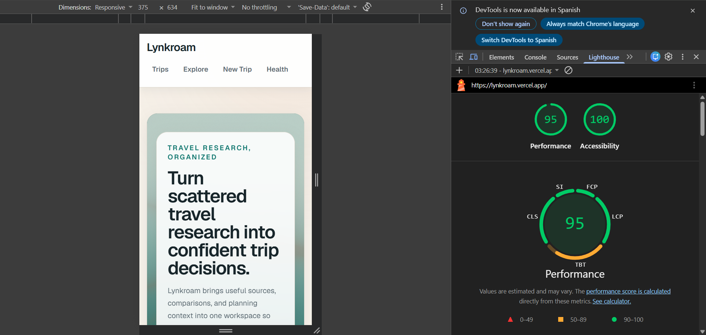
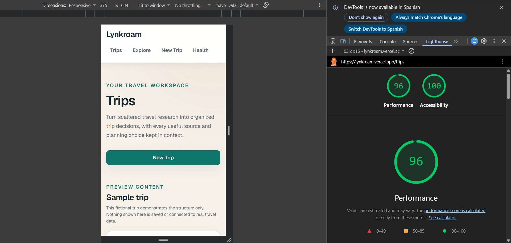
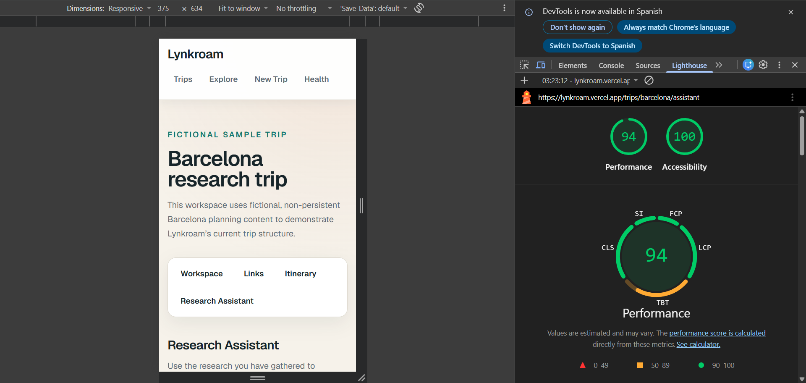
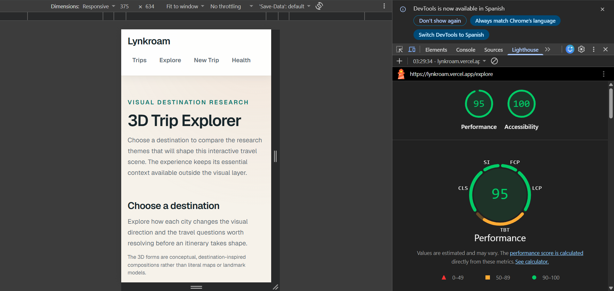
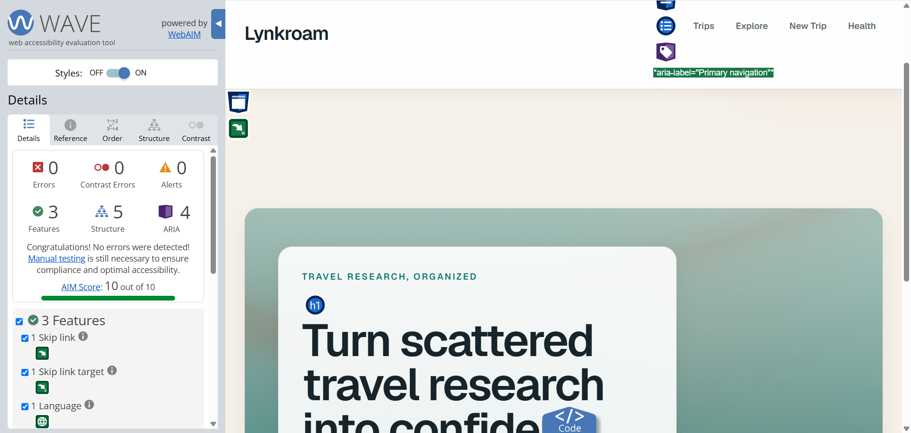
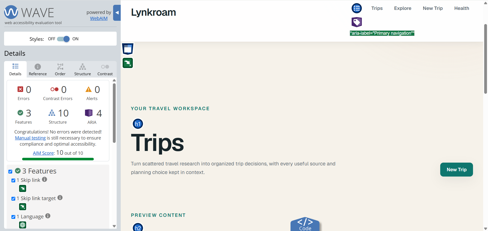
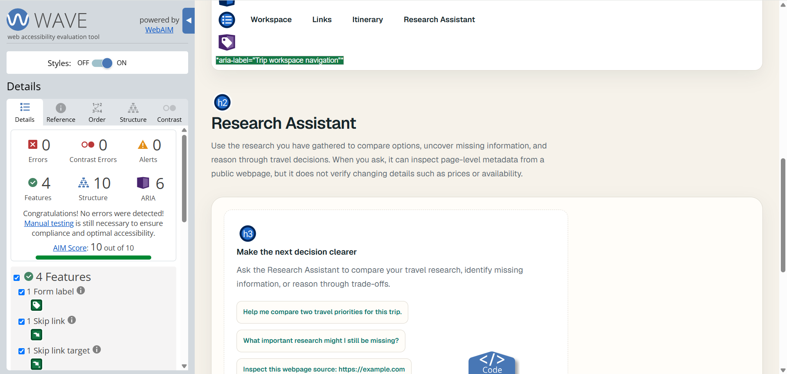
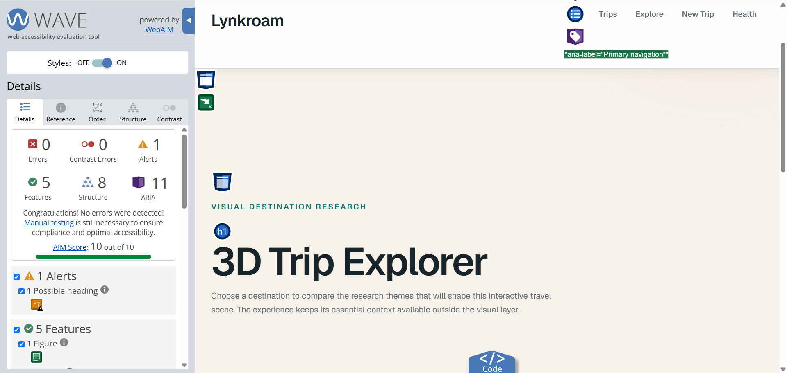

# Lynkroam — Ship It Capstone

## Project brief

Travel research quickly becomes fragmented across tabs, links, notes, and changing priorities. Lynkroam is for travelers who need to organize and reason through that scattered trip research, and I chose the idea because I wanted to explore how a focused interface and AI-assisted reasoning could turn fragmented information into clearer travel decisions without pretending to replace the user's judgment.

## Live application

- **Production:** [https://lynkroam.vercel.app](https://lynkroam.vercel.app)
- **Repository:** [https://github.com/damiannogueira/lynkroam](https://github.com/damiannogueira/lynkroam)

The deployed application is functional rather than a mockup. Its Barcelona trip and other displayed travel details are fictional sample content; trips, research, and conversations are not persisted.

## Product overview

Lynkroam is a visual travel research workspace that keeps sources, comparisons, and planning context connected to the decisions they inform. The landing page at `/` introduces the product, `/trips` exposes the sample trip dashboard, and the trip workspace organizes research, links, itinerary context, and a trip-scoped Research Assistant. `/explore` provides a progressively enhanced 3D Trip Explorer, while `/motion` demonstrates the reusable action-state interaction used in the product's design system.

The Research Assistant helps travelers compare options, identify missing research, and reason through priorities without presenting itself as an automatic itinerary generator. The 3D Trip Explorer complements that workflow with conceptual destination-inspired compositions and useful static content when 3D rendering is unavailable or inappropriate.

## AI integration

The Research Assistant uses Gemini 3.6 Flash through the Vercel AI SDK. The browser sends typed conversation messages to the server-side `/api/chat` Route Handler, which validates and normalizes them, converts them to model messages, forwards request cancellation, and streams UI-message responses back to the client.

The system guidance keeps the model focused on comparing research, surfacing trade-offs, identifying missing information, and supporting the traveler's judgment. It explicitly tells the model not to invent facts such as prices, availability, opening hours, restrictions, or other information the user has not supplied. This makes the AI useful as a reasoning layer over travel research rather than a generic chatbot or text echo.

When a user supplies a public webpage URL and asks for page-level inspection, the model can call the server-side `fetchUrlMetadata` tool. The tool returns the final URL, hostname, title, description, and site name when available. Metadata inspection does not verify changing facts such as live prices or availability. A request is limited to two model/tool steps and 1,600 output tokens.

## Architecture

- **Application:** Next.js 16 App Router, React 19, TypeScript, and Tailwind CSS.
- **Rendering boundary:** Pages and shared layouts are Server Components by default; focused Client Components own chat, motion, WebGL, and 3D interaction.
- **AI layer:** `/api/chat` owns validation, model conversion, Gemini configuration, streaming, tool execution, and safe errors. Provider configuration and credentials stay server-only.
- **Deferred chat runtime:** The accessible shell and composer render immediately, while `useChat` and its AI SDK client runtime load on genuine user interaction without replacing the textarea.
- **Visual experiences:** The landing hero uses a small custom raw-WebGL shader. The heavier Three.js and React Three Fiber explorer is progressively enhanced and loaded only after explicit user intent.
- **Quality:** Vitest, React Testing Library, and Playwright cover components, route behavior, shader lifecycle, and critical user flows. GitHub Actions runs lint, component tests, and Chromium E2E checks.
- **Delivery:** GitHub is connected to Vercel, with `main` as the Production Branch and feature branches receiving Preview Deployments.

## Resilience and production safeguards

The public AI endpoint applies deterministic per-request safeguards before model conversion:

| Safeguard | Limit or behavior |
| --- | --- |
| Request body | 65,536 bytes |
| Validated messages | 50 maximum |
| Individual text part | 4,000 characters maximum |
| Total conversation text | 24,000 characters maximum |
| Model output | 1,600 tokens maximum |
| Model/tool steps | 2 maximum |
| Function duration | `maxDuration = 60` seconds |
| Cancellation | Client Stop propagates through the request abort signal |
| Malformed input | HTTP 400 |
| Oversized input | HTTP 413 before model conversion or streaming |

`fetchUrlMetadata` times out after eight seconds, follows at most three redirects, and reads at most 1,000,000 HTML bytes. It accepts only public HTTP/HTTPS targets and rejects credential-bearing URLs, obvious local/private-network targets, unsupported content, and oversized responses. These controls bound individual requests; Lynkroam does not currently implement a global per-user or per-IP rate limiter.

The interface also provides designed failure behavior: Stop preserves partial streamed content, Retry regenerates only the failed assistant response, tool failures render safe recovery guidance, and the Assistant route has a scoped error boundary with reset recovery. `/api/health` and `/health` expose lightweight application health information and a visible health state.

## Testing evidence

Current verified automated results:

- **Vitest:** 9 test files, 64 tests passed.
- **Direct component-file coverage:** 8 directly tested component files out of 14 relevant exported component files, or **57.1%**. This exceeds the capstone requirement of 50%.
- **Playwright:** 3 critical Chromium E2E flows passed.
- **AI isolation:** the Research Assistant E2E intercepts `/api/chat` with a deterministic stream and does not require or call Gemini.

The 57.1% figure is an explicit direct component-file inventory, not V8 line, function, or branch instrumentation. Directly tested components include `FetchUrlMetadataTool`, `ResearchAssistantChat`, `ResearchAssistantChatRuntime`, `SignatureShaderHero`, `TripExplorer`, and the capstone additions `ResearchCard`, `StatusColumn`, and `StatefulActionButton`.

The browser suite covers landing-to-dashboard navigation, the Research Assistant's primary streamed flow, and destination selection plus progressive 3D launch behavior.

## Performance and accessibility

The final Production application was audited with Chrome Lighthouse in Mobile mode. Three runs were collected for each representative route, and the median Performance score is reported. Accessibility scored 100 across all 12 runs in this primary three-run set.

| Route | Performance median | Accessibility |
| --- | ---: | ---: |
| `/` | 95 | 100 |
| `/trips` | 96 | 100 |
| `/trips/barcelona/assistant` | 94 | 100 |
| `/explore` | 95 | 100 |

### Lighthouse evidence

The final Production WAVE review produced:

| Route | Errors | Contrast errors | Alerts |
| --- | ---: | ---: | ---: |
| `/` | 0 | 0 | 0 |
| `/trips` | 0 | 0 | 0 |
| `/trips/barcelona/assistant` | 0 | 0 | 0 |
| `/explore` | 0 | 0 | 1 |

The single `/explore` alert was WAVE's “Possible heading” heuristic for the visually prominent destination name in the static figure. That element is intentionally a figure label referenced by `aria-labelledby`, not a separate section heading, and the view already contains a semantic destination heading. Manual review concluded that no code change was required; a WAVE Alert is not itself a WCAG violation.

### WAVE evidence

A manual Production Narrator check confirmed that streamed responses were announced progressively, focus remained stable, and keyboard navigation remained usable after completion.

Earlier FE-10 evidence in [AUDIT.md](AUDIT.md) is historical. It records the investigation that led to concrete improvements including stronger text contrast, a corrected metadata heading hierarchy, sentence-batched live announcements, and deferred loading of the Assistant runtime. The scores and WAVE results above are the fresh final-Production capstone audit.

## Deployment and operations

### Completed deployment checklist

- [x] Production connected to Vercel.
- [x] Vercel Production Branch set to `main`.
- [x] Production domain verified at [https://lynkroam.vercel.app](https://lynkroam.vercel.app).
- [x] Server-side Gemini credential configured for the Production environment.
- [x] No secret values committed to Git.
- [x] Final Production deployment verified functional.
- [x] ESLint passed.
- [x] Vitest and React Testing Library passed: 64 tests.
- [x] Playwright passed: 3 critical flows.
- [x] Production build passed.
- [x] Cross-browser Production review completed.
- [x] Final accessibility and performance audit completed.

**Capstone release sign-off:** completed on 2026-09-13.

### Safe failure

Invalid and oversized chat requests fail before model execution with generic HTTP 400 or 413 responses. Streaming, tool, and route failures use designed UI states without displaying raw internal errors. Users can stop generation, retain partial output, retry the failed response, or reset the Assistant route, while bounded model and metadata operations reduce uncontrolled work.

### Operational visibility

- `/api/health` returns uncached application, environment, status, and timestamp information.
- `/health` presents that status through the product UI.
- GitHub Actions reports lint, component-test, and E2E status for repository changes.
- Vercel deployment and runtime logs provide build and server-side operational visibility.

No separate external monitoring service is currently configured.

### Rollback

If Production regresses, identify the most recent known-good deployment in Vercel, verify its commit and runtime behavior, and promote or redeploy that retained deployment. Then use the Git/GitHub history to revert the responsible commit through the normal reviewed integration flow, validate the resulting Preview, and release the corrective change. Previous deployments provide rollback candidates; this project does not claim that a rollback was performed during the capstone.

## Known limitations and future improvements

Current limitations include:

- Trip, research, and conversation data are fictional and non-persistent.
- Authentication, accounts, collaboration, and database workflows are not implemented.
- LLM responses can be incomplete or incorrect and should support, not replace, user judgment.
- Metadata inspection does not validate live prices, availability, opening hours, or restrictions.
- Per-request safeguards exist, but there is no global per-user or per-IP rate limiter.
- The 3D Trip Explorer is a conceptual destination-inspired visualization, not a literal geographic map or landmark model.

### Future improvements

Future work could add authenticated persistence, durable trip and chat history, collaboration, broader current-data integrations, a global rate-limiting strategy, stronger operational monitoring, and a local recovery boundary for a failed deferred chat-runtime chunk. The explorer could gain richer destination-specific detail while preserving explicit loading, static fallbacks, and reduced-motion behavior.

## Reflection

### What was hardest?

The hardest part was not building one isolated feature, but keeping the whole product coherent as streaming AI, tool results, error states, accessibility, performance, 3D content, and production safeguards were added incrementally. Changes that looked small often affected several layers at once, so validating the actual source, tests, browser behavior, and deployment became as important as writing the code.

### What would I do differently next time?

Next time I would define the final production evidence and testing strategy earlier, especially component-coverage targets, accessibility checkpoints, and release documentation. That would reduce the amount of final reconciliation needed at the end.

### One thing that surprised me

I learned that production readiness is much more than a successful build or deployment. Small details such as streaming announcements, input limits, deferred loading, reduced-motion fallbacks, rollback planning, and documenting what AI tools actually did can materially change whether a project is simply working or genuinely shippable.

## AI-assisted development

Codex integrated in VS Code was used through small, scoped prompts for implementation, refactors, testing, repository inspection, and controlled Git work. Suggestions were reviewed against the actual source and diffs rather than accepted as opaque output. ESLint, Vitest, React Testing Library, Playwright, production builds, Vercel Preview and Production deployments, and manual review were used to validate the work. Gemini 3.6 Flash is Lynkroam's runtime AI model, not the development assistant, and product and architecture decisions remained developer-reviewed throughout.

## Evidence index

- [Production application](https://lynkroam.vercel.app)
- [Repository README](README.md)
- [FE-10 accessibility and performance audit](AUDIT.md)
- [Home Lighthouse evidence](docs/capstone/CAPSTONE_Lighthouse_Home.png)
- [Trips Lighthouse evidence](docs/capstone/CAPSTONE_Lighthouse_Trips.png)
- [Research Assistant Lighthouse evidence](docs/capstone/CAPSTONE_Lighthouse_Assistant.png)
- [Trip Explorer Lighthouse evidence](docs/capstone/CAPSTONE_Lighthouse_Explore.png)
- [Home WAVE evidence](docs/capstone/CAPSTONE_WAVE_Home.png)
- [Trips WAVE evidence](docs/capstone/CAPSTONE_WAVE_Trips.png)
- [Research Assistant WAVE evidence](docs/capstone/CAPSTONE_WAVE_Assistant.png)
- [Trip Explorer WAVE evidence](docs/capstone/CAPSTONE_WAVE_Explore.png)
- [GitHub Actions workflow](.github/workflows/test.yml)
- [Component and Route Handler tests](src/)
- [Playwright E2E tests](e2e/)
