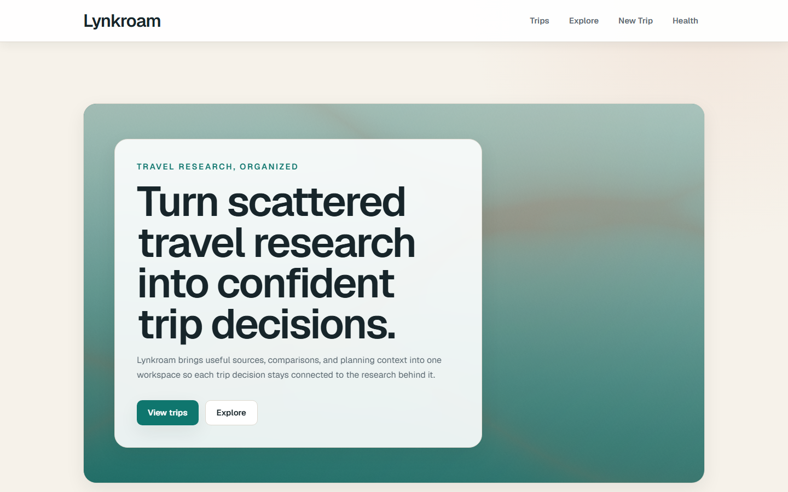
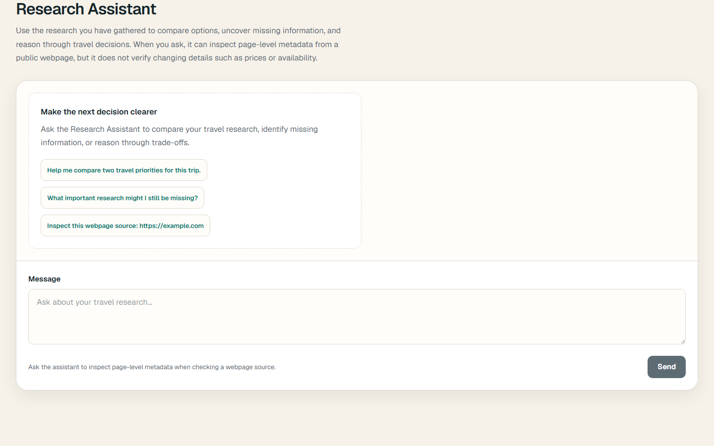

# Lynkroam

Lynkroam is a visual travel research workspace that turns scattered sources, comparisons, and planning context into organized trip decisions. It keeps the research behind each choice visible instead of acting as a generic bookmark manager or automatically generating an itinerary.

- **Production:** [https://lynkroam.vercel.app](https://lynkroam.vercel.app)
- **Repository:** [https://github.com/damiannogueira/lynkroam](https://github.com/damiannogueira/lynkroam)

The final FE-11 production verification will happen after the completed work is integrated into `main`; this README does not imply that every change on the current feature branch is already deployed to Production.

## Screenshots

### Signature landing hero



### Research Assistant



## Product scope

The current application includes:

- A real landing page with a custom raw-WebGL signature hero
- A Trips dashboard and fictional Barcelona research workspace
- Source/link, itinerary, and trip-scoped Research Assistant views
- Streamed Google Gemini responses through Vercel AI SDK
- A typed server-side `fetchUrlMetadata` tool with designed lifecycle states
- Accessible waiting, streaming, retry, error, and scrolling behavior
- A health endpoint and visual health page
- A progressively enhanced procedural 3D Trip Explorer at `/explore`
- A focused motion and state micro-interaction demo at `/motion`
- Automated Vitest, React Testing Library, and Playwright coverage
- Accessibility and performance work documented in [AUDIT.md](AUDIT.md)

Displayed trip information is fictional sample content. Authentication, persistence, real trip creation, and persisted chat history are not implemented.

## Routes

| Route | Purpose |
| --- | --- |
| `/` | Product landing page and signature shader hero |
| `/trips` | Trips dashboard with the sample Barcelona trip |
| `/trips/new` | Visual Create Trip form |
| `/trips/[tripId]` | Trip research workspace |
| `/trips/[tripId]/links` | Organized links and source context |
| `/trips/[tripId]/itinerary` | Curated itinerary view |
| `/trips/[tripId]/assistant` | Streaming travel Research Assistant |
| `/explore` | Procedural 3D Trip Explorer |
| `/motion` | Motion and state micro-interaction demo |
| `/health` | Visual application health status |
| `/api/health` | JSON health endpoint |
| `/api/chat` | Validated streaming AI and typed-tool endpoint |

## Quick start

### Prerequisites

- Node.js 22 recommended (matches CI)
- npm
- Git

```bash
git clone https://github.com/damiannogueira/lynkroam.git
cd lynkroam
npm ci
```

For the real Research Assistant flow, create a local `.env.local` and set the server-side `GOOGLE_GENERATIVE_AI_API_KEY`. Leave it unset if you only need to review the non-AI product surfaces. `HEALTHCHECK_ORIGIN` is optional. Never commit secret values.

```dotenv
GOOGLE_GENERATIVE_AI_API_KEY=
HEALTHCHECK_ORIGIN=
```

Start the application:

```bash
npm run dev
```

Open [http://localhost:3000](http://localhost:3000). The fictional workspace is available at `/trips/barcelona`.

## Environment variables

| Variable | Required? | Environment / scope | Purpose |
| --- | --- | --- | --- |
| `GOOGLE_GENERATIVE_AI_API_KEY` | For real AI requests | User-supplied server secret; local `.env.local` and required Vercel environments | Authenticates the server-side Google Gemini provider. It is never exposed through a `NEXT_PUBLIC_` variable. |
| `HEALTHCHECK_ORIGIN` | Optional | Application server | Overrides the origin used by the internal health request when Lynkroam is served outside Vercel. |
| `VERCEL_URL` | System-provided on Vercel | Vercel runtime | Supplies the deployment hostname used by the health utility when no explicit origin is configured. |
| `VERCEL_ENV` | System-provided on Vercel | Vercel runtime | Identifies the current Vercel environment in the health response. |
| `VERCEL_AUTOMATION_BYPASS_SECRET` | Conditional | Vercel server-side system secret | Lets the internal health request pass Deployment Protection on protected Previews. |
| `PORT` | Optional/runtime-provided | Local or hosting runtime | Selects the local fallback port for health checks; defaults to `3000`. |

The tracked `.env.example` contains names and empty values only. Real `.env*` files remain ignored.

## Architecture

Lynkroam uses Next.js 16 App Router and React 19. Pages and shared layout components remain Server Components by default. Focused Client Components own only browser interaction such as chat state, motion, WebGL, and the 3D destination controls.

```text
Browser
  -> Next.js Server Component UI
  -> isolated interactive Client Component
  -> POST /api/chat
  -> Vercel AI SDK / Google Gemini
  -> typed fetchUrlMetadata tool when requested
  -> streamed UI message response
```

The Research Assistant shell stays immediately usable while its `useChat` runtime is dynamically loaded on genuine user interaction. `/api/chat` validates typed UI messages, converts them server-side, forwards request cancellation, and streams the response back to the persistent shell.

The landing page uses a small raw-WebGL client leaf for its custom route-field fragment shader, avoiding a Three.js dependency on `/`. The heavier Three.js and React Three Fiber scene is isolated to `/explore` and loaded only after the user chooses **Launch 3D view**. Both experiences retain useful CSS/static fallbacks and respect reduced motion.

Vercel builds Production from the GitHub-connected production branch and creates Preview Deployments for feature branches.

## Production safeguards

The public AI route applies deterministic per-request limits before model conversion:

- Request body: 64 KiB of actual encoded bytes
- Validated messages: 50 maximum
- Individual text part: 4,000 characters maximum
- Total conversation text: 24,000 characters maximum
- Model output: 1,600 tokens maximum
- Model/tool steps: 2 maximum
- Streaming function duration: 60 seconds
- Client Stop action propagated through the request abort signal

`fetchUrlMetadata` accepts public HTTP/HTTPS pages, follows at most three redirects, times out after eight seconds, and reads at most 1,000,000 HTML bytes. It rejects unsupported protocols, credential-bearing URLs, obvious local/private-network targets, non-HTML responses, and oversized pages.

These input caps constrain abusive or unexpectedly large individual requests. They are **not** a global per-user or per-IP rate limiter.

## Important engineering decisions

- **Server Components by default:** limits browser JavaScript and keeps provider/tool configuration server-only.
- **Deferred chat runtime:** preserves an immediately usable composer while keeping AI SDK runtime code off the initial Assistant route payload until interaction.
- **Deferred Three/R3F:** `/explore` remains useful as a static destination experience before an explicit 3D launch.
- **Raw WebGL landing hero:** gives Lynkroam a custom shader identity without adding Three/R3F to the landing bundle.
- **Progressive enhancement:** shader, WebGL, reduced-motion, Save-Data, and unavailable-context fallbacks preserve content and controls.
- **Deterministic AI limits:** bounded input, output, duration, and tool steps reduce uncontrolled request cost.
- **Typed tool output:** metadata lifecycle parts render as designed UI rather than raw JSON.

## How AI tools were used

Codex integrated in VS Code was used through small, tightly scoped prompts to implement features, perform refactors, add tests, inspect repository state, and carry out controlled Git tasks. Suggestions were reviewed against the actual source and diffs rather than accepted as opaque generated output.

Each change was validated proportionally with ESLint, Vitest, React Testing Library, Playwright, production builds, `git diff --check`, Vercel Preview Deployments, and manual browser review. AI-assisted investigation also helped reason about accessibility semantics, streaming resilience, bundle performance, deferred loading, WebGL/shader lifecycle behavior, and documentation. The developer made the product and architecture decisions and accepted, adjusted, or rejected generated changes after verification; the project was AI-assisted, not blindly or entirely AI-generated.

## Testing

Install Chromium once in a fresh clone before running the browser suite:

```bash
npx playwright install chromium
```

Run the project checks:

```bash
npm run lint
npm run test:run
npm run test:e2e
npm run build
```

- Vitest and React Testing Library cover component, controller, shader lifecycle, and Route Handler behavior.
- Playwright covers critical landing, Research Assistant, and Trip Explorer flows in Chromium.
- The Research Assistant E2E intercepts `/api/chat` with a deterministic stream, so it does not call Gemini or consume provider credits.
- `npm run build` performs the production compile and TypeScript validation.

## Deployment

The Vercel project is connected to GitHub. `main` is intended as the Production Branch, while feature and assignment branches receive Preview Deployments for review. Final FE-11 Production verification will occur after the completed work is integrated into `main`.

Production URL: [https://lynkroam.vercel.app](https://lynkroam.vercel.app)

Vercel retains previous deployments that can be selected as rollback candidates. This repository does not claim that a rollback has been performed.

## Non-goals

The current product does not include:

- Authentication or user accounts
- Persistence or database workflows
- Real trip creation
- Collaboration
- Billing
